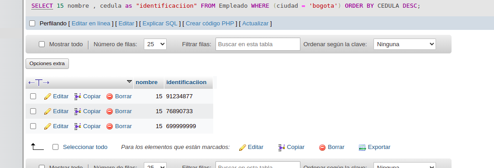

1. Traer el nombre cedula y slario de un empleado ordenand los cmapo s de la siguiente manera ascendente por nombre y descendente por cedula.

SELECT nomobre, cedula, sueldo FROM Empleados WEHERE(ciudad = `medellin`)ORDER BY nombre;

SELECT nomobre, cedula, sueldo FROM Empleados WEHERE(ciudad = `medellin`)ORDER BY cedula desc;

2. Traer el nombre y el saleio de los ṕrimeros 25 empleados cuyo sueldo es mayor de 600000 ordenandolos en forma ascendente por el numero de cedula.

SELECT TOP 25 nombre, sueldo FROM Emepleados WHERE(sueldo>600000)ORDER BY CEDULA;

3. Mostrar el nombre id y cedula de los primeros 15 empleados cuyos nombres sean distintos. orden la consulya en forma ascendente por cedula.

SELECT DISTINCT TOP 15 nombre,id,cedula FROM Empleado ORDER BY cedula desc;

4. ENtregar ios primeros 15 empleados con nombre y cedula cuya identidad sea bogta, se necesita qe los encabezados de las columnas tengan los isguientes titulos:

a. Para el campo nombre___razon social
b. parae el caampo cedula___identificacion
c. ordene la lista en forma descendente por cedula

SELECT TOP 15 nombre as "razon social", cedula as "identificaciion" FROM Empleados WHERE (ciudad = `bogota`) ORDER BY CEDULA DESC;

6. Realizar una consulta que se muestre nombre cedula salario de los empelados cuyo nombre comience por la letra c. ordene esra lista por salario en forma descendete.

SELECT nombre, cedula, sueldo FROM Empleados WHERE (nombre like`c%`) ORDER BY sueldodesc

